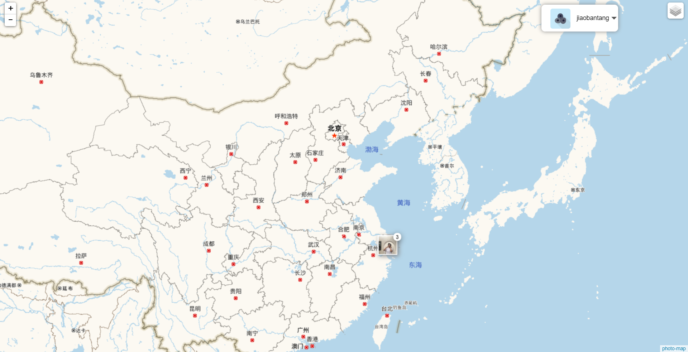
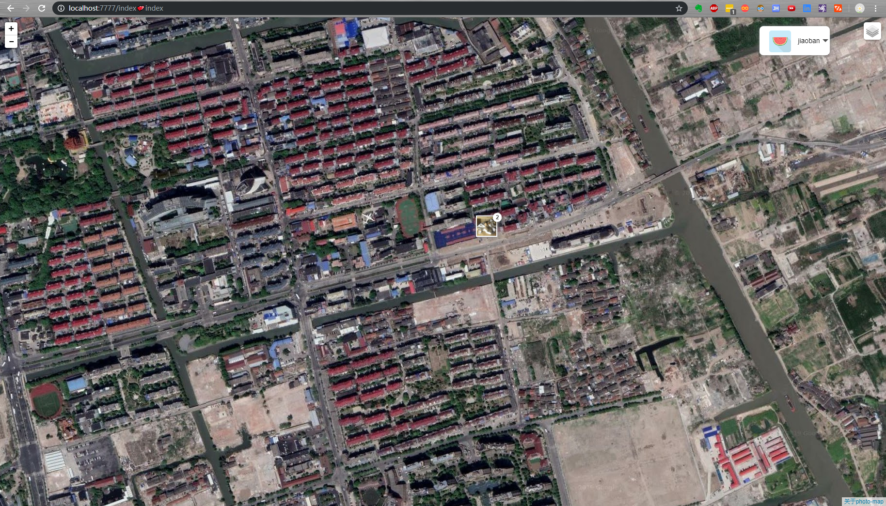
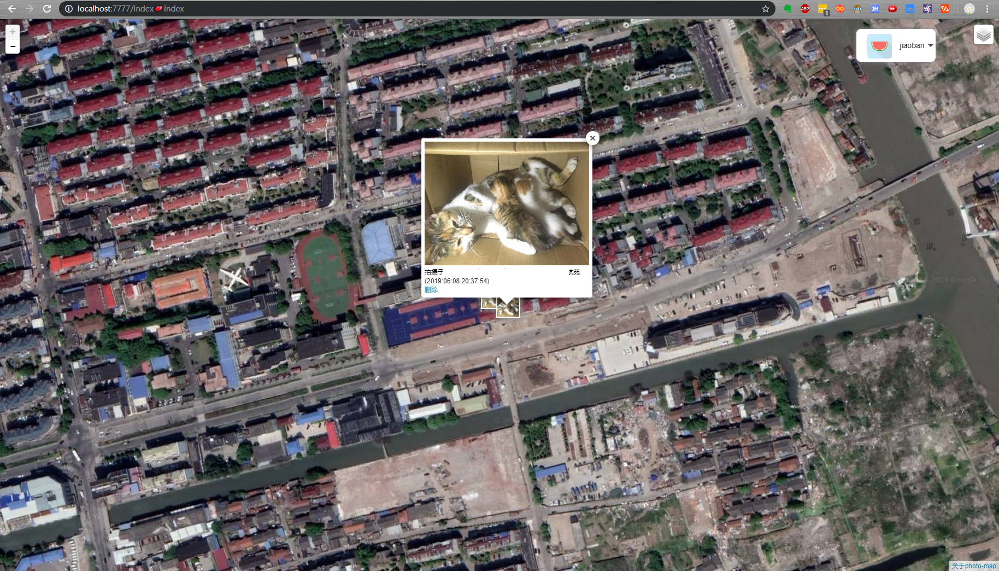

## Photo-Map
### 一款Web站点的地图相册

**灵感来源于:iphone的地图相册** 
**脑袋想的是:记录足迹，服务生活** 
### 感谢
[Leaflet](https://github.com/Leaflet/Leaflet)用于基础地图交互 
[Leaflet.Photo](https://github.com/turban/Leaflet.Photo)用于渲染图片位置 
[Leaflet.ChineseTmsProviders](https://github.com/htoooth/Leaflet.ChineseTmsProviders)用于各种地图样式 
[layui](https://www.layui.com/)用于前端交互 
[viewerjs](https://github.com/fengyuanchen/viewerjs/)用于查看图片 
[高德地图](https://www.amap.com/)用于获取位置信息 
[googleauthenticator](https://github.com/Vectorface/GoogleAuthenticator)用于谷歌身份验证器验证 
[webp-convert](https://github.com/rosell-dk/webp-convert)用于压缩图为webp格式 
### 站点
[关于]() 
[部署站点](http://photo.treelo.xin/) 
### 目录结构
PHPMVC
~~~
├─controllers           控制器目录
├─libs                  工具目录
│  └─functions.php     公共函数   
├─models                模型目录
│  ├─Base.php          数据库基类    
│  └─....              其他操作文件
├─public                WEB目录（对外访问目录）
│  ├─index.php         入口文件      
│  └─....              其他的都是资源文件
├─views                 视图目录
├─vendor                composer扩展包目录
├─config.php            配置文件
├─photo-map.sql         数据库文件
├─composer.json         composer扩展包管理
~~~
### 运行(windows)
1. 安装或开启EXIF和GD扩展
2. 配置数据库，导入sql文件
3. config.example.php修改为config.php,并修改相应配置
4. composer install
5. PHP内置服务器
~~~
php -S localhost:9999 -t public
~~~
### 部署
1. 安装或开启EXIF和GD扩展
2. 配置数据库，导入sql文件
3. config.example.php修改为config.php,并修改相应配置
4. composer install
5. 修改nginx配置
~~~
#路由重写
location / { if (!-e $request_filename) { rewrite ^(.*)$ /index.php/$1 last; } }
~~~
6. 修改php.ini

~~~
open_basedir =/站点路径/photo-map/:/tmp/
~~~
### 欢迎添砖加瓦

