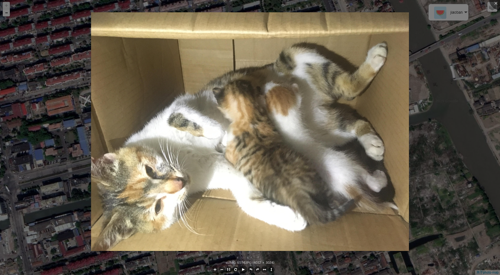

## Photo-Map
### 一款Web站点的地图相册(v 1.0)

**灵感来源于:iphone的地图相册** 
**脑袋想的是:记录足迹，服务生活** 
### 感谢
[Leaflet](https://github.com/Leaflet/Leaflet) 
[Leaflet.Photo](https://github.com/turban/Leaflet.Photo) 
[Leaflet.ChineseTmsProviders](https://github.com/htoooth/Leaflet.ChineseTmsProviders) 
[layui](https://www.layui.com/) 
[viewerjs](https://github.com/fengyuanchen/viewerjs/) 
[谷歌地图]() 
[高德地图](https://www.amap.com/) 
[她]()
### 站点
[关于](https://blog.treelo.xin/2019/06/09/photo-map/) 
[部署站点](https://photo.treelo.xin/) 

### 目录结构
PHPMVC
~~~
├─controllers           控制器目录
├─libs                  
│  └─functions.php      公共函数   
├─models                模型目录
│  ├─Base.php           数据库基类    
│  └─....               其他操作文件
├─public                WEB目录（对外访问目录）
│  ├─index.php          入口文件      
│  └─....               其他的都是资源文件
├─views                 视图目录
├─config.php            配置文件
├─photo-map.sql         数据库文件
~~~
### 运行
**安装或开启EXIF扩展**
**修改对应配置**
首先修改数据库配置，并导入sql文件
接着修改:
~~~
//高德地图webKey（用于获取定位信息）
'map-key'=>'',
//盐（用于加密）
'encryption_value'=>'',
//邀请码明文()
'encryption_key'=>'',
//加盐邀请码(请自行生成，然后保存于此)
'encryption_value_code'=>'',
//网站域名(现已无实际用途)
'domain'=>'http://photo.treelo.xin/',
//二级路由小心心  windows：'💕' liunx:'%F0%9F%92%95'
'ext-hart'=>'💕'
~~~
windows:
php内置服务器
~~~
php -S localhost:9999 -t public
~~~
### 部署
1. 安装或开启EXIF扩展
2. 修改配置文件里的二级路由小心心
3. 修改php.ini
>open_basedir =/站点路径/photo-map/:/tmp/
4. 为public/photos和public/temp设置777 权限
### 欢迎添砖加瓦

